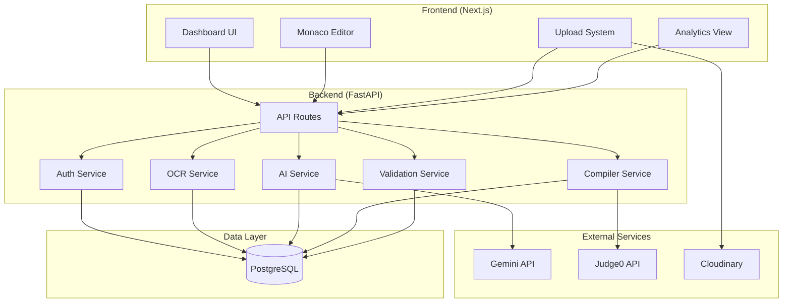
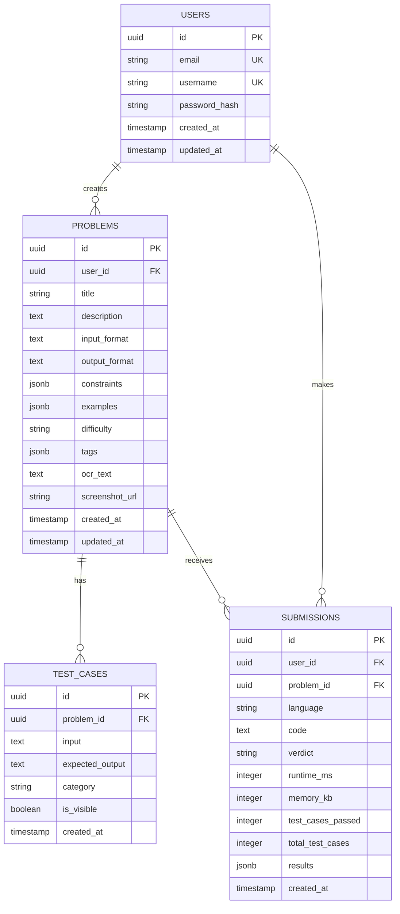

# 🚀 IntelliJudge — Implementation Plan
## AI Coding Question Recovery & Practice Platform

---

## 📋 Table of Contents
1. [Project Overview](#project-overview)
2. [Architecture](#architecture)
3. [Technology Stack](#technology-stack)
4. [Directory Structure](#directory-structure)
5. [Phase 0 — Foundation Setup](#phase-0--foundation-setup)
6. [Phase 1 — OCR Pipeline](#phase-1--ocr-pipeline)
7. [Phase 2 — AI Problem Reconstruction](#phase-2--ai-problem-reconstruction)
8. [Phase 3 — Compiler Engine](#phase-3--compiler-engine)
9. [Phase 4 — Test Case System](#phase-4--test-case-system)
10. [Phase 5 — AI Features](#phase-5--ai-features)
11. [Phase 6 — Dashboard & Analytics](#phase-6--dashboard--analytics)
12. [API Contracts](#api-contracts)
13. [Database Schema](#database-schema)
14. [Deployment Strategy](#deployment-strategy)

---

## Project Overview

CrackCoder is an AI-powered platform that solves a common student problem: **failing to solve a coding question during an assessment, keeping only a screenshot, and having no way to practice it later.**

### Core Workflow
```
Screenshot Upload → OCR Extraction → AI Reconstruction → Structured Problem
     → Code Editor → Compiler Execution → Test Case Validation
     → Verdict → AI Feedback → Analytics Dashboard
```

---

## Architecture



---

## Technology Stack

| Layer | Technology | Purpose |
|-------|-----------|---------|
| **Frontend** | Next.js 15 + TypeScript | SSR, routing, UI |
| **Styling** | Tailwind CSS v4 | Utility-first CSS (user-requested) |
| **Code Editor** | Monaco Editor | VS Code-like editing |
| **Backend** | FastAPI + Python | REST API, business logic |
| **ORM** | SQLAlchemy + Alembic | DB models + migrations |
| **Database** | PostgreSQL (Neon) | Relational data store |
| **OCR** | EasyOCR | Screenshot text extraction |
| **AI** | Google Gemini API | Problem reconstruction, hints, feedback |
| **Compiler** | Judge0 API | Sandboxed code execution |
| **Storage** | Cloudinary | Screenshot image hosting |
| **Auth** | JWT + bcrypt | Stateless authentication |

---

## Directory Structure

### Monorepo Layout
```
compilor project/
├── frontend/                    # Next.js application
│   ├── src/
│   │   ├── app/                 # App router pages
│   │   │   ├── (auth)/          # Auth pages (login, register)
│   │   │   ├── dashboard/       # Main dashboard
│   │   │   ├── problem/[id]/    # Problem view + editor
│   │   │   ├── upload/          # Screenshot upload
│   │   │   ├── analytics/       # Analytics dashboard
│   │   │   ├── layout.tsx
│   │   │   ├── page.tsx         # Landing page
│   │   │   └── globals.css
│   │   ├── components/
│   │   │   ├── ui/              # Reusable UI components
│   │   │   ├── editor/          # Monaco editor wrapper
│   │   │   ├── upload/          # Upload components
│   │   │   ├── problem/         # Problem display
│   │   │   ├── dashboard/       # Dashboard widgets
│   │   │   └── layout/          # Nav, sidebar, footer
│   │   ├── lib/
│   │   │   ├── api.ts           # API client
│   │   │   ├── auth.ts          # Auth utilities
│   │   │   └── utils.ts         # Helpers
│   │   ├── hooks/               # Custom React hooks
│   │   ├── types/               # TypeScript types
│   │   └── stores/              # Zustand state management
│   ├── public/
│   ├── next.config.ts
│   ├── tailwind.config.ts
│   ├── tsconfig.json
│   └── package.json
│
├── backend/                     # FastAPI application
│   ├── app/
│   │   ├── main.py              # FastAPI app entry
│   │   ├── config.py            # Settings & env vars
│   │   ├── database.py          # DB connection
│   │   ├── models/              # SQLAlchemy models
│   │   │   ├── __init__.py
│   │   │   ├── user.py
│   │   │   ├── problem.py
│   │   │   ├── submission.py
│   │   │   └── test_case.py
│   │   ├── schemas/             # Pydantic schemas
│   │   │   ├── __init__.py
│   │   │   ├── user.py
│   │   │   ├── problem.py
│   │   │   ├── submission.py
│   │   │   └── test_case.py
│   │   ├── routes/              # API route handlers
│   │   │   ├── __init__.py
│   │   │   ├── auth.py
│   │   │   ├── problems.py
│   │   │   ├── submissions.py
│   │   │   ├── upload.py
│   │   │   └── analytics.py
│   │   ├── services/            # Business logic layer
│   │   │   ├── __init__.py
│   │   │   ├── auth_service.py
│   │   │   ├── ocr_service.py
│   │   │   ├── ai_service.py
│   │   │   ├── compiler_service.py
│   │   │   ├── validation_service.py
│   │   │   └── analytics_service.py
│   │   ├── utils/               # Utility functions
│   │   │   ├── __init__.py
│   │   │   ├── jwt.py
│   │   │   ├── hashing.py
│   │   │   └── exceptions.py
│   │   └── migrations/          # Alembic migrations
│   │       ├── versions/
│   │       ├── env.py
│   │       └── alembic.ini
│   ├── requirements.txt
│   ├── .env.example
│   └── Dockerfile
│
├── .gitignore
├── README.md
└── docker-compose.yml           # Local dev orchestration
```

---

## Phase 0 — Foundation Setup

> **Goal**: Project scaffolding, database, auth, and basic API health.

### Frontend Tasks
- [ ] Initialize Next.js 15 with TypeScript + Tailwind CSS
- [ ] Set up app router structure
- [ ] Create base layout with navigation
- [ ] Build landing page (hero, features, CTA)
- [ ] Build login & register pages
- [ ] Set up API client with axios/fetch
- [ ] Implement auth context + JWT token management
- [ ] Set up Zustand for global state

### Backend Tasks
- [ ] Initialize FastAPI project structure
- [ ] Configure `.env` and settings management (pydantic-settings)
- [ ] Set up PostgreSQL connection with SQLAlchemy async
- [ ] Create User model + migration
- [ ] Build auth routes: `/register`, `/login`, `/me`
- [ ] Implement JWT token generation & verification
- [ ] Password hashing with bcrypt
- [ ] Global exception handling middleware
- [ ] CORS configuration
- [ ] Health check endpoint: `GET /health`

### Database Schema (Phase 0)
```sql
CREATE TABLE users (
    id UUID PRIMARY KEY DEFAULT gen_random_uuid(),
    email VARCHAR(255) UNIQUE NOT NULL,
    username VARCHAR(100) UNIQUE NOT NULL,
    password_hash VARCHAR(255) NOT NULL,
    created_at TIMESTAMP DEFAULT NOW(),
    updated_at TIMESTAMP DEFAULT NOW()
);
```

### Key API Endpoints
| Method | Endpoint | Description |
|--------|----------|-------------|
| `POST` | `/api/auth/register` | Register new user |
| `POST` | `/api/auth/login` | Login, returns JWT |
| `GET` | `/api/auth/me` | Get current user profile |
| `GET` | `/api/health` | Health check |

---

## Phase 1 — OCR Pipeline

> **Goal**: Screenshot upload → OCR text extraction → cleaned output.

### Frontend Tasks
- [ ] Build screenshot upload page with drag-and-drop
- [ ] Image preview before upload
- [ ] Upload progress indicator
- [ ] Display raw OCR results

### Backend Tasks
- [ ] Integrate Cloudinary for image storage
- [ ] Build upload route: `POST /api/upload/screenshot`
- [ ] Integrate EasyOCR for text extraction
- [ ] Build OCR cleanup pipeline (remove noise, fix formatting)
- [ ] Store extracted text in database
- [ ] Return structured OCR result

### OCR Service Flow
```
Upload Image → Validate Format → Store in Cloudinary
     → Download for OCR → EasyOCR Extract → Clean Text
     → Store in DB → Return Result
```

### Key API Endpoints
| Method | Endpoint | Description |
|--------|----------|-------------|
| `POST` | `/api/upload/screenshot` | Upload screenshot, run OCR |
| `GET` | `/api/upload/{id}/ocr-result` | Get OCR extraction result |

---

## Phase 2 — AI Problem Reconstruction

> **Goal**: Transform OCR text into a structured coding problem.

### Frontend Tasks
- [ ] Build problem reconstruction preview
- [ ] Allow user to edit/correct AI output
- [ ] Problem display component (title, description, examples, constraints)
- [ ] Save reconstructed problem

### Backend Tasks
- [ ] Build AI service with Gemini API integration
- [ ] Design reconstruction prompt (OCR text → structured JSON)
- [ ] Create Problem model + migration
- [ ] Parse AI response into structured problem
- [ ] Store problem in database
- [ ] Build problem CRUD routes

### AI Prompt Design
```
Given the following OCR-extracted text from a coding question screenshot,
reconstruct a complete, structured coding problem in JSON format:

{
  "title": "...",
  "description": "...",
  "input_format": "...",
  "output_format": "...",
  "constraints": ["..."],
  "examples": [
    {"input": "...", "output": "...", "explanation": "..."}
  ],
  "difficulty": "easy|medium|hard",
  "tags": ["arrays", "dp", ...]
}
```

### Database Schema (Phase 2)
```sql
CREATE TABLE problems (
    id UUID PRIMARY KEY DEFAULT gen_random_uuid(),
    user_id UUID REFERENCES users(id),
    title VARCHAR(500) NOT NULL,
    description TEXT NOT NULL,
    input_format TEXT,
    output_format TEXT,
    constraints JSONB,
    examples JSONB,
    difficulty VARCHAR(20),
    tags JSONB,
    ocr_text TEXT,
    screenshot_url TEXT,
    created_at TIMESTAMP DEFAULT NOW(),
    updated_at TIMESTAMP DEFAULT NOW()
);
```

### Key API Endpoints
| Method | Endpoint | Description |
|--------|----------|-------------|
| `POST` | `/api/problems/reconstruct` | AI-reconstruct from OCR text |
| `GET` | `/api/problems` | List user's problems |
| `GET` | `/api/problems/{id}` | Get problem details |
| `PUT` | `/api/problems/{id}` | Edit problem |
| `DELETE` | `/api/problems/{id}` | Delete problem |

---

## Phase 3 — Compiler Engine

> **Goal**: Integrated code editor with compilation and execution.

### Frontend Tasks
- [ ] Integrate Monaco Editor component
- [ ] Language selector (C++, Java, Python, JavaScript)
- [ ] Code templates per language
- [ ] Run button with loading state
- [ ] Output panel (stdout, stderr, execution time, memory)
- [ ] Custom input panel

### Backend Tasks
- [ ] Integrate Judge0 API client
- [ ] Build compiler service (submit, poll, result)
- [ ] Language ID mapping for Judge0
- [ ] Handle execution states (queued, processing, done)
- [ ] Timeout and error handling
- [ ] Build submission routes

### Judge0 Integration Flow
```
User Code + Input → Submit to Judge0 → Poll Status
     → Get Result (stdout, stderr, time, memory, status)
     → Return to Frontend
```

### Supported Languages
| Language | Judge0 ID |
|----------|-----------|
| C++ (17) | 54 |
| Java (17) | 62 |
| Python 3 | 71 |
| JavaScript (Node) | 63 |

### Key API Endpoints
| Method | Endpoint | Description |
|--------|----------|-------------|
| `POST` | `/api/submissions/run` | Run code with custom input |
| `POST` | `/api/submissions/submit` | Submit solution for judging |
| `GET` | `/api/submissions/{id}` | Get submission result |

---

## Phase 4 — Test Case System

> **Goal**: Generate, store, and validate test cases for problems.

### Frontend Tasks
- [ ] Display visible test cases on problem page
- [ ] Test case result indicators (pass/fail per case)
- [ ] Add custom test case UI
- [ ] Execution details per test case

### Backend Tasks
- [ ] Create TestCase model + migration
- [ ] AI-generated test cases via Gemini
- [ ] Test case categories: sample, hidden, edge, stress
- [ ] Validation engine: compare outputs
- [ ] Batch execution of all test cases
- [ ] Verdict computation logic

### Validation Logic
```python
def validate(expected: str, actual: str) -> bool:
    # Strip whitespace, normalize line endings
    # Handle floating point tolerance
    # Handle multiple valid outputs (if applicable)
    return normalized(expected) == normalized(actual)
```

### Verdict Priority
```
Compilation Error > Runtime Error > TLE > MLE > Wrong Answer > Accepted
```

### Database Schema (Phase 4)
```sql
CREATE TABLE test_cases (
    id UUID PRIMARY KEY DEFAULT gen_random_uuid(),
    problem_id UUID REFERENCES problems(id),
    input TEXT NOT NULL,
    expected_output TEXT NOT NULL,
    category VARCHAR(20) DEFAULT 'sample',  -- sample, hidden, edge, stress
    is_visible BOOLEAN DEFAULT true,
    created_at TIMESTAMP DEFAULT NOW()
);

CREATE TABLE submissions (
    id UUID PRIMARY KEY DEFAULT gen_random_uuid(),
    user_id UUID REFERENCES users(id),
    problem_id UUID REFERENCES problems(id),
    language VARCHAR(20) NOT NULL,
    code TEXT NOT NULL,
    verdict VARCHAR(50),
    runtime_ms INTEGER,
    memory_kb INTEGER,
    test_cases_passed INTEGER DEFAULT 0,
    total_test_cases INTEGER DEFAULT 0,
    results JSONB,  -- per-test-case results
    created_at TIMESTAMP DEFAULT NOW()
);
```

### Key API Endpoints
| Method | Endpoint | Description |
|--------|----------|-------------|
| `POST` | `/api/problems/{id}/generate-tests` | AI-generate test cases |
| `GET` | `/api/problems/{id}/test-cases` | List test cases |
| `POST` | `/api/problems/{id}/test-cases` | Add custom test case |
| `DELETE` | `/api/test-cases/{id}` | Delete test case |

---

## Phase 5 — AI Features

> **Goal**: AI-powered feedback, hints, edge case analysis, and optimization suggestions.

### Frontend Tasks
- [ ] AI feedback panel on wrong answer
- [ ] Hint request button
- [ ] Edge case warnings display
- [ ] Optimization suggestions view

### Backend Tasks
- [ ] AI feedback service (analyze failed submissions)
- [ ] Hint generation (progressive hints, not full solutions)
- [ ] Edge case detection from problem + code analysis
- [ ] Optimization suggestions (time/space complexity analysis)
- [ ] Rate limiting on AI requests

### AI Feedback Prompt
```
The user submitted code for the following problem:
[Problem Description]

Their code:
[User Code]

Failed test case:
Input: [...]
Expected: [...]
Got: [...]

Provide:
1. What went wrong (without giving the solution)
2. Which edge cases they might have missed
3. A hint towards the correct approach
4. Complexity analysis of their current approach
```

### Key API Endpoints
| Method | Endpoint | Description |
|--------|----------|-------------|
| `POST` | `/api/ai/feedback` | Get AI feedback on failed submission |
| `POST` | `/api/ai/hints` | Get progressive hints |
| `POST` | `/api/ai/edge-cases` | Analyze potential edge cases |
| `POST` | `/api/ai/optimize` | Get optimization suggestions |

---

## Phase 6 — Dashboard & Analytics

> **Goal**: Track progress, submissions, strengths, and weaknesses.

### Frontend Tasks
- [ ] Main dashboard with recent activity
- [ ] Submission history table with filtering
- [ ] Topic-wise accuracy charts (radar chart)
- [ ] Difficulty distribution (pie chart)
- [ ] Streak tracker
- [ ] Performance trends (line chart)

### Backend Tasks
- [ ] Analytics aggregation queries
- [ ] Topic-wise accuracy computation
- [ ] Submission history with pagination
- [ ] Performance metrics calculation
- [ ] Caching for analytics data

### Analytics Data Points
| Metric | Description |
|--------|-------------|
| Total Problems | Count of reconstructed problems |
| Solved Count | Problems with "Accepted" verdict |
| Accuracy Rate | Solved / Total attempts |
| Topic Breakdown | Accuracy per tag (arrays, DP, etc.) |
| Language Distribution | Submissions by language |
| Avg Runtime | Mean execution time |
| Streak | Consecutive days with activity |

### Key API Endpoints
| Method | Endpoint | Description |
|--------|----------|-------------|
| `GET` | `/api/analytics/overview` | Dashboard summary stats |
| `GET` | `/api/analytics/topics` | Topic-wise breakdown |
| `GET` | `/api/analytics/submissions` | Paginated submission history |
| `GET` | `/api/analytics/trends` | Performance over time |

---

## API Contracts

### Standard Response Format
```json
{
  "success": true,
  "data": { ... },
  "message": "Operation successful",
  "errors": null
}
```

### Error Response Format
```json
{
  "success": false,
  "data": null,
  "message": "Validation error",
  "errors": [
    { "field": "email", "message": "Invalid email format" }
  ]
}
```

### Authentication
- All protected routes require: `Authorization: Bearer <JWT_TOKEN>`
- Token expiry: 24 hours
- Refresh flow: Re-login (MVP), refresh tokens (future)

---

## Database Schema (Complete ERD)



---

## Deployment Strategy

### Development
- **Frontend**: `npm run dev` (localhost:3000)
- **Backend**: `uvicorn app.main:app --reload` (localhost:8000)
- **Database**: Local PostgreSQL or Neon dev branch

### Production
| Service | Platform | Notes |
|---------|----------|-------|
| Frontend | Vercel | Auto-deploy from main branch |
| Backend | Railway | Docker container |
| Database | Neon PostgreSQL | Serverless, auto-scaling |
| Images | Cloudinary | CDN-backed storage |

### Environment Variables
```env
# Backend
DATABASE_URL=postgresql+asyncpg://...
JWT_SECRET=...
GEMINI_API_KEY=...
JUDGE0_API_KEY=...
JUDGE0_API_URL=https://judge0-ce.p.rapidapi.com
CLOUDINARY_CLOUD_NAME=...
CLOUDINARY_API_KEY=...
CLOUDINARY_API_SECRET=...

# Frontend
NEXT_PUBLIC_API_URL=http://localhost:8000/api
```

---

## MVP Scope (What We Build First)

> [!IMPORTANT]
> The MVP focuses on proving the **core workflow** end-to-end:

1. ✅ User auth (register/login)
2. ✅ Screenshot upload + OCR extraction
3. ✅ AI problem reconstruction
4. ✅ Code editor with execution
5. ✅ Visible test case validation
6. ✅ Basic verdict system

**Deferred to post-MVP**: Analytics dashboard, AI hints, edge case generation, stress testing, Docker sandbox.

---

## Execution Order

| Priority | Phase | Estimated Effort |
|----------|-------|-----------------|
| 🔴 P0 | Phase 0 — Foundation | ~2-3 hours |
| 🔴 P0 | Phase 1 — OCR Pipeline | ~2 hours |
| 🔴 P0 | Phase 2 — AI Reconstruction | ~2 hours |
| 🟡 P1 | Phase 3 — Compiler Engine | ~2-3 hours |
| 🟡 P1 | Phase 4 — Test Case System | ~2 hours |
| 🟢 P2 | Phase 5 — AI Features | ~2 hours |
| 🟢 P2 | Phase 6 — Analytics | ~2-3 hours |

**I recommend starting with Phase 0 (Backend + Frontend foundation) immediately.**

---

> [!TIP]
> Ready to start building? Confirm the plan and I'll begin with Phase 0 — scaffolding both the Next.js frontend and FastAPI backend, setting up the database, and implementing authentication.
